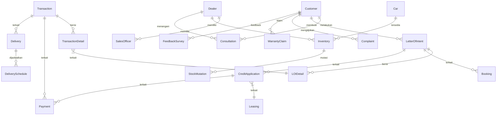

# Final Project: Business Process Modeling for AutoCar Dealership

## 1. Pendahuluan

Repositori ini berisi skema database dan query SQL yang dirancang untuk memodelkan proses bisnis di AutoCar Dealership. Desain ini mencakup seluruh alur penjualan mobil, mulai dari konsultasi awal hingga layanan purna jual, dan dirancang untuk mendukung operasi di berbagai cabang dealer.

## 2. Struktur File

```
.
├── final-project-documentation.md
├── final-project-draft.md
├── final-project-schema.sql
├── final-project-data.sql
├── scenarios.md
├── scenarios-test-data.sql
└── FinalProject.bak
```

## 3. Deskripsi File Utama

### [`final-project-schema.sql`](final-project-schema.sql)
File ini berisi seluruh skrip SQL untuk:
- Membuat database `FinalProject`.
- Membuat semua tabel yang diperlukan, lengkap dengan kolom, tipe data, dan constraint.
- Mendefinisikan relasi antar tabel menggunakan foreign key.
- Membuat stored procedures untuk proses bisnis utama.
- Membuat functions untuk kalkulasi.
- Membuat views untuk pelaporan.
- Membuat triggers untuk otomatisasi.

### [`final-project-documentation.md`](final-project-documentation.md)
Dokumentasi ini (file ini) berisi penjelasan rinci tentang:
- Makna setiap tabel.
- Desain kolom untuk setiap tabel.
- Relasi antar tabel beserta diagram ERD.
- Penjelasan untuk setiap stored procedure, function, view, dan trigger.

## 4. Desain Database

### Makna Setiap Entitas/Tabel
| No. | Tabel              | Makna/Deskripsi                                                                 |
|-----|--------------------|---------------------------------------------------------------------------------|
| 1   | LetterOfIntent     | Header dokumen LOI, berisi info umum pemesanan dan pelanggan                    |
| 2   | LOIDetail          | Rincian unit mobil yang dipesan dalam satu LOI (bisa lebih dari satu mobil per LOI) |
| 3   | Transaction        | Catatan transaksi penjualan yang dibuat setelah pembayaran dan administrasi selesai |
| 4   | TransactionDetail  | Rincian unit mobil yang dibeli dalam satu transaksi (bisa lebih dari satu mobil per transaksi) |
| 5   | Consultation       | Catatan konsultasi awal: kebutuhan, preferensi, tanggal, dan hasil diskusi      |
| 6   | Dealer             | Data dealer AutoCar, lokasi, dan identitas dealer                               |
| 7   | Customer           | Menyimpan data pelanggan yang melakukan pembelian mobil                         |
| 8   | SalesOfficer       | Data petugas penjualan yang menangani pelanggan                                 |
| 9   | Car                | Data mobil yang tersedia untuk dijual di setiap dealer                          |
| 10  | TestDrive          | Catatan aktivitas test drive oleh pelanggan                                     |
| 11  | Negotiation        | Riwayat negosiasi harga, diskon, atau paket aksesoris                           |
| 12  | Booking            | Data pembayaran booking fee dan status booking                                  |
| 13  | CreditApplication  | Data pengajuan kredit oleh pelanggan                                            |
| 14  | Leasing            | Data perusahaan leasing yang bekerja sama                                       |
| 15  | Document           | Dokumen pendukung pengajuan kredit (KTP, slip gaji, dll)                        |
| 16  | Payment            | Catatan pembayaran DP, pelunasan, atau cicilan kredit                           |
| 17  | Administration     | Proses administrasi STNK, BPKB, pajak, asuransi                                 |
| 18  | Delivery           | Proses serah terima mobil ke pelanggan                                          |
| 19  | DeliverySchedule   | Penjadwalan pengiriman kendaraan ke pelanggan                                   |
| 20  | Inspection         | Catatan Pre-Delivery Inspection (PDI) oleh teknisi                              |
| 21  | AfterSalesService  | Layanan purna jual, seperti follow-up servis pertama                            |
| 22  | Complaint          | Catatan keluhan pelanggan terkait produk atau layanan                           |
| 23  | WarrantyClaim      | Klaim garansi kendaraan oleh pelanggan                                          |
| 24  | Inventory          | Data stok mobil di setiap dealer                                                |
| 25  | StockMutation      | Catatan mutasi (perpindahan) stok antar dealer                                  |
| 26  | FeedbackSurvey     | Feedback atau survey kepuasan pelanggan setelah transaksi                       |

### Diagram Relasi (ERD)


## 5. Catatan Tambahan
- Seluruh file SQL dapat dijalankan di Microsoft SQL Server.
- Untuk detail implementasi kolom, relasi, dan logika bisnis, silakan merujuk ke file [`final-project-schema.sql`](final-project-schema.sql).