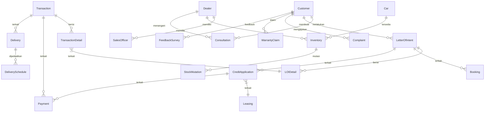

# Dokumentasi Awal: Business Process Modeling AutoCar Dealership

## 1. Pendahuluan

Dokumentasi ini memetakan proses bisnis penjualan mobil di AutoCar Dealership ke dalam entitas dan tabel database, sebagai dasar desain sistem informasi yang mendukung berbagai dealer AutoCar.

## 2. Pemetaan Proses Bisnis ke Entitas/Tabel

| Proses Bisnis                | Entitas/Tabel Utama         | Makna/Deskripsi Singkat                                                                 |
|------------------------------|-----------------------------|----------------------------------------------------------------------------------------|
| Konsultasi Awal              | Consultation, Dealer, Customer, SalesOfficer, Car | Data konsultasi awal, dealer, pelanggan, petugas penjualan, dan mobil yang diminati |
| Test Drive & Negosiasi       | TestDrive, Negotiation      | Catatan test drive dan hasil negosiasi harga/paket                                      |
| Kesepakatan & Booking Fee    | Booking, LetterOfIntent, LOIDetail     | Pencatatan booking fee, dokumen LOI (header), dan detail unit mobil di LOI             |
| Proses Kredit                | CreditApplication, Leasing, Document | Pengajuan kredit, data leasing, dan dokumen pendukung                          |
| Pembayaran & Administrasi    | Payment, Administration, Transaction, TransactionDetail | Pembayaran DP/lunas, administrasi, transaksi penjualan, dan detail mobil yang dibeli   |
| Serah Terima Mobil           | Delivery, Inspection, Transaction, TransactionDetail, DeliverySchedule | Proses PDI, serah terima mobil, penjadwalan pengiriman, transaksi, dan detail mobil    |
| Pasca-Penjualan              | AfterSalesService, Complaint, WarrantyClaim, FeedbackSurvey, Transaction | Layanan follow-up servis pertama, penanganan keluhan, klaim garansi, feedback pelanggan, dan transaksi |
| Manajemen Stok & Mutasi      | Inventory, StockMutation, Dealer, Car | Pengelolaan stok mobil dan mutasi antar dealer                                          |

## 3. Makna Setiap Entitas/Tabel

| No. | Tabel              | Makna/Deskripsi                                                                 |
|-----|--------------------|---------------------------------------------------------------------------------|
| 1   | LetterOfIntent     | Header dokumen LOI, berisi info umum pemesanan dan pelanggan                    |
| 2   | LOIDetail          | Rincian unit mobil yang dipesan dalam satu LOI (bisa lebih dari satu mobil per LOI) |
| 3   | Transaction        | Catatan transaksi penjualan yang dibuat setelah pembayaran dan administrasi selesai |
| 4   | TransactionDetail  | Rincian unit mobil yang dibeli dalam satu transaksi (bisa lebih dari satu mobil per transaksi) |
| 5   | Consultation       | Catatan konsultasi awal: kebutuhan, preferensi, tanggal, dan hasil diskusi      |
| 6   | Dealer             | Data dealer AutoCar, lokasi, dan identitas dealer                               |
| 7   | Customer           | Menyimpan data pelanggan yang melakukan pembelian mobil                         |
| 8   | SalesOfficer       | Data petugas penjualan yang menangani pelanggan                                 |
| 9   | Car                | Data mobil yang tersedia untuk dijual di setiap dealer                          |
| 10  | TestDrive          | Catatan aktivitas test drive oleh pelanggan                                     |
| 11  | Negotiation        | Riwayat negosiasi harga, diskon, atau paket aksesoris                           |
| 12  | Booking            | Data pembayaran booking fee dan status booking                                  |
| 13  | CreditApplication  | Data pengajuan kredit oleh pelanggan                                            |
| 14  | Leasing            | Data perusahaan leasing yang bekerja sama                                       |
| 15  | Document           | Dokumen pendukung pengajuan kredit (KTP, slip gaji, dll)                        |
| 16  | Payment            | Catatan pembayaran DP, pelunasan, atau cicilan kredit                           |
| 17  | Administration     | Proses administrasi STNK, BPKB, pajak, asuransi                                 |
| 18  | Delivery           | Proses serah terima mobil ke pelanggan                                          |
| 19  | DeliverySchedule   | Penjadwalan pengiriman kendaraan ke pelanggan                                   |
| 20  | Inspection         | Catatan Pre-Delivery Inspection (PDI) oleh teknisi                              |
| 21  | AfterSalesService  | Layanan purna jual, seperti follow-up servis pertama                            |
| 22  | Complaint          | Catatan keluhan pelanggan terkait produk atau layanan                           |
| 23  | WarrantyClaim      | Klaim garansi kendaraan oleh pelanggan                                          |
| 24  | Inventory          | Data stok mobil di setiap dealer                                                |
| 25  | StockMutation      | Catatan mutasi (perpindahan) stok antar dealer                                  |
| 26  | FeedbackSurvey     | Feedback atau survey kepuasan pelanggan setelah transaksi                       |

## 4. Relasi Antar Entitas/Tabel

| Relasi                        | Tabel Sumber         | Tabel Tujuan         | Kardinalitas & Makna                                                                 |
|-------------------------------|----------------------|----------------------|--------------------------------------------------------------------------------------|
| Dealer memiliki banyak        | SalesOfficer         | Dealer               | Satu dealer punya banyak sales officer                                               |
| Dealer memiliki banyak        | Inventory            | Dealer               | Satu dealer punya banyak stok mobil                                                  |
| Dealer memiliki banyak        | Consultation         | Dealer               | Satu dealer menangani banyak konsultasi                                              |
| Customer melakukan banyak     | Consultation         | Customer             | Satu customer bisa melakukan banyak konsultasi                                       |
| Customer melakukan banyak     | LetterOfIntent       | Customer             | Satu customer bisa membuat banyak LOI                                                |
| LetterOfIntent memiliki banyak| LOIDetail            | LetterOfIntent       | Satu LOI bisa berisi banyak mobil                                                    |
| Transaction memiliki banyak     | TransactionDetail      | Transaction            | Satu transaksi bisa berisi banyak mobil                                              |
| LetterOfIntent terkait        | Booking              | LetterOfIntent       | Satu LOI bisa punya satu/many booking                                                |
| CreditApplication terkait     | Leasing              | CreditApplication    | Satu pengajuan kredit bisa terkait dengan satu perusahaan leasing                    |
| LetterOfIntent terkait        | CreditApplication    | LetterOfIntent       | Satu LOI bisa punya satu/many pengajuan kredit                                       |
| Transaction terkait             | Payment              | Transaction            | Satu transaksi bisa punya banyak pembayaran                                          |
| CreditApplication terkait     | Payment              | CreditApplication    | Satu pengajuan kredit bisa punya banyak pembayaran cicilan                           |
| Transaction terkait             | Delivery             | Transaction            | Satu transaksi bisa punya satu/many pengiriman                                       |
| Delivery terkait              | DeliverySchedule     | Delivery             | Satu pengiriman bisa punya satu jadwal                                               |
| Customer terkait              | Complaint            | Customer             | Satu customer bisa punya banyak keluhan                                              |
| Customer terkait              | WarrantyClaim        | Customer             | Satu customer bisa punya banyak klaim garansi                                        |
| Customer terkait              | FeedbackSurvey       | Customer             | Satu customer bisa punya banyak feedback                                             |
| Car terkait                   | Inventory            | Car                  | Satu mobil bisa ada di banyak stok dealer                                            |
| StockMutation terkait         | Dealer, Inventory    | StockMutation        | Mutasi stok antar dealer dan inventory                                               |
| TransactionDetail terkait       | LOIDetail            | TransactionDetail      | Satu detail transaksi bisa terkait dengan satu detail LOI                            |

## 5. Diagram Relasi (ERD) - Ringkas



## 6. Desain Kolom Tabel Utama

### 1. Tabel: LetterOfIntent (Header)
| Nama Kolom       | Tipe Data      | Keterangan                               |
|------------------|----------------|------------------------------------------|
| LOIId            | INT, PK        | ID unik untuk setiap LOI                 |
| DealerId         | INT, FK        | ID dealer tempat LOI dibuat              |
| CustomerId       | INT, FK        | ID pelanggan yang membuat LOI            |
| SalesOfficerId   | INT, FK        | ID sales officer yang menangani          |
| ConsultationId   | INT, FK        | ID konsultasi terkait (opsional)         |
| TestDriveId      | INT, FK        | ID test drive terkait (opsional)         |
| LOIDate          | DATE           | Tanggal LOI dibuat                       |
| PaymentMethod    | VARCHAR(20)    | Metode pembayaran yang disepakati       |
| Note             | VARCHAR(200)   | Catatan umum untuk LOI                   |

### 2. Tabel: LOIDetail
| Nama Kolom    | Tipe Data      | Keterangan                               |
|---------------|----------------|------------------------------------------|
| LOIDetailId   | INT, PK        | ID unik untuk setiap detail LOI          |
| LOIId         | INT, FK        | ID LOI header                            |
| CarId         | INT, FK        | ID mobil yang dipesan                    |
| FixPrice      | MONEY          | Harga final mobil                        |
| Discount      | MONEY          | Diskon yang diberikan (opsional)         |
| DownPayment   | MONEY          | Uang muka yang dibayar (opsional)        |
| Note          | VARCHAR(200)   | Catatan spesifik untuk unit mobil ini    |

### 3. Tabel: Transaction (Header)
| Nama Kolom      | Tipe Data      | Keterangan                               |
|-----------------|----------------|------------------------------------------|
| TransactionId   | INT, PK        | ID unik untuk setiap transaksi           |
| DealerId        | INT, FK        | ID dealer tempat transaksi terjadi       |
| CustomerId      | INT, FK        | ID pelanggan yang bertransaksi           |
| SalesOfficerId  | INT, FK        | ID sales officer yang menangani          |
| LOIId           | INT, FK        | ID LOI terkait (opsional)                |
| TransactionDate | DATE           | Tanggal transaksi                        |
| TotalAmount     | MONEY          | Total nilai transaksi                    |

### 4. Tabel: TransactionDetail
| Nama Kolom          | Tipe Data      | Keterangan                               |
|---------------------|----------------|------------------------------------------|
| TransactionDetailId | INT, PK        | ID unik untuk setiap detail transaksi    |
| TransactionId       | INT, FK        | ID transaksi header                      |
| LOIDetailId         | INT, FK        | ID detail LOI terkait (opsional)         |
| CarId               | INT, FK        | ID mobil yang dibeli                     |
| Price               | MONEY          | Harga mobil saat transaksi               |
| Discount            | MONEY          | Diskon yang diberikan (opsional)         |
| Note                | VARCHAR(200)   | Catatan spesifik untuk unit mobil ini    |

### 5. Tabel: Consultation
| Nama Kolom       | Tipe Data      | Keterangan                               |
|------------------|----------------|------------------------------------------|
| ConsultationId   | INT, PK        | ID unik untuk setiap konsultasi          |
| DealerId         | INT, FK        | ID dealer tempat konsultasi              |
| CustomerId       | INT, FK        | ID pelanggan yang berkonsultasi          |
| SalesOfficerId   | INT, FK        | ID sales officer yang melayani           |
| CarId            | INT, FK        | ID mobil yang diminati (opsional)        |
| Budget           | MONEY          | Anggaran pelanggan (opsional)            |
| PaymentMethod    | VARCHAR(20)    | Metode pembayaran yang direncanakan     |
| ConsultationDate | DATE           | Tanggal konsultasi                       |
| Note             | VARCHAR(200)   | Catatan dari konsultasi                  |

### 6. Tabel: Dealer
| Nama Kolom   | Tipe Data      | Keterangan                               |
|--------------|----------------|------------------------------------------|
| DealerId     | INT, PK        | ID unik untuk setiap dealer              |
| DealerName   | VARCHAR(100)   | Nama dealer                              |
| City         | VARCHAR(50)    | Kota lokasi dealer                       |
| Address      | VARCHAR(200)   | Alamat lengkap dealer                    |
| PhoneNumber  | VARCHAR(20)    | Nomor telepon dealer                     |

### 7. Tabel: Customer
| Nama Kolom   | Tipe Data      | Keterangan                               |
|--------------|----------------|------------------------------------------|
| CustomerId   | INT, PK        | ID unik untuk setiap pelanggan           |
| CustomerName | VARCHAR(100)   | Nama lengkap pelanggan                   |
| PhoneNumber  | VARCHAR(20)    | Nomor telepon pelanggan                  |
| Email        | VARCHAR(100)   | Alamat email pelanggan                   |
| Address      | VARCHAR(200)   | Alamat lengkap pelanggan                 |

### 8. Tabel: SalesOfficer
| Nama Kolom     | Tipe Data      | Keterangan                               |
|----------------|----------------|------------------------------------------|
| SalesOfficerId | INT, PK        | ID unik untuk setiap sales officer       |
| DealerId       | INT, FK        | ID dealer tempat sales officer bekerja   |
| SalesName      | VARCHAR(100)   | Nama lengkap sales officer               |

### 9. Tabel: Car
| Nama Kolom   | Tipe Data      | Keterangan                               |
|--------------|----------------|------------------------------------------|
| CarId        | INT, PK        | ID unik untuk setiap mobil               |
| CarName      | VARCHAR(100)   | Nama/model mobil (e.g., Mitsu Pajero)    |
| CarType      | VARCHAR(50)    | Tipe mobil (e.g., SUV, MPV)              |
| BasePrice    | MONEY          | Harga dasar mobil                        |
| Year         | INT            | Tahun pembuatan mobil                    |
| Color        | VARCHAR(30)    | Warna mobil                              |

### 10. Tabel: TestDrive
| Nama Kolom       | Tipe Data      | Keterangan                               |
|------------------|----------------|------------------------------------------|
| TestDriveId      | INT, PK        | ID unik untuk setiap test drive          |
| DealerId         | INT, FK        | ID dealer tempat test drive              |
| CustomerId       | INT, FK        | ID pelanggan yang melakukan test drive   |
| SalesOfficerId   | INT, FK        | ID sales officer yang mendampingi        |
| CarId            | INT, FK        | ID mobil yang di-test drive              |
| ConsultationId   | INT, FK        | ID konsultasi terkait (opsional)         |
| TestDriveDate    | DATE           | Tanggal test drive                       |
| Note             | VARCHAR(200)   | Catatan dari test drive                  |

### 11. Tabel: Negotiation
| Nama Kolom      | Tipe Data      | Keterangan                               |
|-----------------|----------------|------------------------------------------|
| NegotiationId   | INT, PK        | ID unik untuk setiap negosiasi           |
| ConsultationId  | INT, FK        | ID konsultasi terkait (opsional)         |
| TestDriveId     | INT, FK        | ID test drive terkait (opsional)         |
| NegotiationDate | DATE           | Tanggal negosiasi                        |
| Discount        | MONEY          | Diskon yang dinegosiasikan               |
| Package         | VARCHAR(100)   | Paket aksesoris yang dinegosiasikan      |
| Note            | VARCHAR(200)   | Catatan dari negosiasi                   |

### 12. Tabel: Booking
| Nama Kolom    | Tipe Data      | Keterangan                               |
|---------------|----------------|------------------------------------------|
| BookingId     | INT, PK        | ID unik untuk setiap booking             |
| LOIId         | INT, FK        | ID LOI terkait                           |
| BookingFee    | MONEY          | Jumlah booking fee                       |
| BookingDate   | DATE           | Tanggal booking                          |
| Status        | VARCHAR(20)    | Status booking (e.g., Confirmed, Cancelled) |

### 13. Tabel: CreditApplication
| Nama Kolom        | Tipe Data      | Keterangan                               |
|-------------------|----------------|------------------------------------------|
| CreditAppId       | INT, PK        | ID unik untuk setiap pengajuan kredit    |
| LOIId             | INT, FK        | ID LOI terkait                           |
| LeasingId         | INT, FK        | ID perusahaan leasing                    |
| ApplicationDate   | DATE           | Tanggal pengajuan                        |
| Status            | VARCHAR(20)    | Status pengajuan (e.g., Approved, Rejected) |

### 14. Tabel: Leasing
| Nama Kolom    | Tipe Data      | Keterangan                               |
|---------------|----------------|------------------------------------------|
| LeasingId     | INT, PK        | ID unik untuk setiap perusahaan leasing  |
| LeasingName   | VARCHAR(100)   | Nama perusahaan leasing                  |
| Address       | VARCHAR(200)   | Alamat perusahaan leasing                |
| PhoneNumber   | VARCHAR(20)    | Nomor telepon perusahaan leasing         |

### 15. Tabel: Document
| Nama Kolom     | Tipe Data      | Keterangan                               |
|----------------|----------------|------------------------------------------|
| DocumentId     | INT, PK        | ID unik untuk setiap dokumen             |
| CreditAppId    | INT, FK        | ID pengajuan kredit terkait              |
| DocumentType   | VARCHAR(50)    | Jenis dokumen (e.g., KTP, Slip Gaji)     |
| DocumentPath   | VARCHAR(200)   | Path file dokumen                        |
| UploadDate     | DATE           | Tanggal upload dokumen                   |

### 16. Tabel: Payment
| Nama Kolom      | Tipe Data      | Keterangan                               |
|-----------------|----------------|------------------------------------------|
| PaymentId       | INT, PK        | ID unik untuk setiap pembayaran          |
| TransactionId   | INT, FK        | ID transaksi terkait (opsional)          |
| CreditAppId     | INT, FK        | ID pengajuan kredit terkait (opsional)   |
| PaymentAmount   | MONEY          | Jumlah pembayaran                        |
| PaymentDate     | DATE           | Tanggal pembayaran                       |
| PaymentType     | VARCHAR(20)    | Jenis pembayaran (e.g., DP, Lunas, Cicilan) |

### 17. Tabel: Administration
| Nama Kolom        | Tipe Data      | Keterangan                               |
|-------------------|----------------|------------------------------------------|
| AdministrationId  | INT, PK        | ID unik untuk setiap administrasi        |
| TransactionId     | INT, FK        | ID transaksi terkait                     |
| STNKNumber        | VARCHAR(50)    | Nomor STNK                               |
| BPKBNumber        | VARCHAR(50)    | Nomor BPKB                               |
| TaxStatus         | VARCHAR(50)    | Status pajak                             |
| InsuranceStatus   | VARCHAR(50)    | Status asuransi                          |

### 18. Tabel: Delivery
| Nama Kolom    | Tipe Data      | Keterangan                               |
|---------------|----------------|------------------------------------------|
| DeliveryId    | INT, PK        | ID unik untuk setiap pengiriman          |
| TransactionId | INT, FK        | ID transaksi terkait                     |
| DeliveryDate  | DATE           | Tanggal pengiriman                       |
| Status        | VARCHAR(20)    | Status pengiriman (e.g., Delivered, In Progress) |

### 19. Tabel: DeliverySchedule
| Nama Kolom         | Tipe Data      | Keterangan                               |
|--------------------|----------------|------------------------------------------|
| DeliveryScheduleId | INT, PK        | ID unik untuk setiap jadwal pengiriman   |
| DeliveryId         | INT, FK        | ID pengiriman terkait                    |
| ScheduledDate      | DATE           | Tanggal yang dijadwalkan                 |
| Note               | VARCHAR(200)   | Catatan untuk jadwal pengiriman          |

### 20. Tabel: Inspection
| Nama Kolom      | Tipe Data      | Keterangan                               |
|-----------------|----------------|------------------------------------------|
| InspectionId    | INT, PK        | ID unik untuk setiap inspeksi            |
| DeliveryId      | INT, FK        | ID pengiriman terkait                    |
| InspectionDate  | DATE           | Tanggal inspeksi                         |
| InspectorName   | VARCHAR(100)   | Nama inspektur                           |
| Note            | VARCHAR(200)   | Catatan dari inspeksi                    |

### 21. Tabel: AfterSalesService
| Nama Kolom    | Tipe Data      | Keterangan                               |
|---------------|----------------|------------------------------------------|
| ServiceId     | INT, PK        | ID unik untuk setiap layanan purna jual  |
| TransactionId | INT, FK        | ID transaksi terkait                     |
| ServiceDate   | DATE           | Tanggal layanan                          |
| ServiceType   | VARCHAR(50)    | Jenis layanan (e.g., Servis Pertama)     |
| Note          | VARCHAR(200)   | Catatan dari layanan                     |

### 22. Tabel: Complaint
| Nama Kolom    | Tipe Data      | Keterangan                               |
|---------------|----------------|------------------------------------------|
| ComplaintId   | INT, PK        | ID unik untuk setiap keluhan             |
| CustomerId    | INT, FK        | ID pelanggan yang mengajukan keluhan     |
| TransactionId | INT, FK        | ID transaksi terkait (opsional)          |
| ComplaintDate | DATE           | Tanggal keluhan                          |
| Description   | VARCHAR(200)   | Deskripsi keluhan                        |
| Status        | VARCHAR(20)    | Status penanganan keluhan                |

### 23. Tabel: WarrantyClaim
| Nama Kolom      | Tipe Data      | Keterangan                               |
|-----------------|----------------|------------------------------------------|
| WarrantyClaimId | INT, PK        | ID unik untuk setiap klaim garansi       |
| CustomerId      | INT, FK        | ID pelanggan yang mengajukan klaim       |
| TransactionId   | INT, FK        | ID transaksi terkait (opsional)          |
| ClaimDate       | DATE           | Tanggal klaim                            |
| Description     | VARCHAR(200)   | Deskripsi klaim                          |
| Status          | VARCHAR(20)    | Status penanganan klaim                  |

### 24. Tabel: Inventory
| Nama Kolom    | Tipe Data      | Keterangan                               |
|---------------|----------------|------------------------------------------|
| InventoryId   | INT, PK        | ID unik untuk setiap entri inventaris    |
| DealerId      | INT, FK        | ID dealer pemilik stok                   |
| CarId         | INT, FK        | ID mobil dalam stok                      |
| Stock         | INT            | Jumlah stok mobil                        |

### 25. Tabel: StockMutation
| Nama Kolom     | Tipe Data      | Keterangan                               |
|----------------|----------------|------------------------------------------|
| MutationId     | INT, PK        | ID unik untuk setiap mutasi stok         |
| FromDealerId   | INT, FK        | ID dealer asal                           |
| ToDealerId     | INT, FK        | ID dealer tujuan                         |
| CarId          | INT, FK        | ID mobil yang dimutasi                   |
| Quantity       | INT            | Jumlah mobil yang dimutasi               |
| MutationDate   | DATE           | Tanggal mutasi                           |

### 26. Tabel: FeedbackSurvey
| Nama Kolom    | Tipe Data      | Keterangan                               |
|---------------|----------------|------------------------------------------|
| FeedbackId    | INT, PK        | ID unik untuk setiap feedback            |
| CustomerId    | INT, FK        | ID pelanggan yang memberikan feedback    |
| TransactionId | INT, FK        | ID transaksi terkait (opsional)          |
| FeedbackDate  | DATE           | Tanggal feedback                         |
| Rating        | INT            | Peringkat kepuasan (1-5)                 |
| Comment       | VARCHAR(200)   | Komentar dari pelanggan                  |

## 7. Stored Procedures

### 1. Pendaftaran Pelanggan Baru
Stored procedure ini akan digunakan untuk mendaftarkan pelanggan baru ke dalam sistem.

**Nama:** `sp_RegisterCustomer`

**Parameter:**
- `@CustomerName VARCHAR(100)`
- `@PhoneNumber VARCHAR(20)`
- `@Email VARCHAR(100)`
- `@Address VARCHAR(200)`

**Proses:**
1.  Menambahkan data pelanggan baru ke tabel `Customer`.
2.  Mengembalikan `CustomerId` dari pelanggan yang baru saja ditambahkan.

```sql
CREATE PROCEDURE sp_RegisterCustomer
    @CustomerName VARCHAR(100),
    @PhoneNumber VARCHAR(20),
    @Email VARCHAR(100),
    @Address VARCHAR(200)
AS
BEGIN
    INSERT INTO Customer (CustomerName, PhoneNumber, Email, Address)
    VALUES (@CustomerName, @PhoneNumber, @Email, @Address);

    SELECT SCOPE_IDENTITY() AS CustomerId;
END
```

### 2. Pengajuan Kredit
Stored procedure ini akan digunakan untuk mengajukan kredit baru.

**Nama:** `sp_ApplyForCredit`

**Parameter:**
- `@LOIId INT`
- `@LeasingId INT`

**Proses:**
1.  Menambahkan data pengajuan kredit baru ke tabel `CreditApplication`.
2.  Mengembalikan `CreditAppId` dari pengajuan yang baru saja ditambahkan.

```sql
CREATE PROCEDURE sp_ApplyForCredit
    @LOIId INT,
    @LeasingId INT
AS
BEGIN
    INSERT INTO CreditApplication (LOIId, LeasingId, ApplicationDate, Status)
    VALUES (@LOIId, @LeasingId, GETDATE(), 'Pending');

    SELECT SCOPE_IDENTITY() AS CreditAppId;
END
```

### 3. Serah Terima Mobil
Stored procedure ini akan digunakan untuk mencatat serah terima mobil.

**Nama:** `sp_CarDelivery`

**Parameter:**
- `@TransactionId INT`

**Proses:**
1.  Menambahkan data serah terima baru ke tabel `Delivery`.
2.  Mengupdate status transaksi menjadi 'Completed'.

```sql
CREATE PROCEDURE sp_CarDelivery
    @TransactionId INT
AS
BEGIN
    INSERT INTO Delivery (TransactionId, DeliveryDate, Status)
    VALUES (@TransactionId, GETDATE(), 'Delivered');

    -- Assuming there is a Status column in the Transaction table
    -- UPDATE Transaction SET Status = 'Completed' WHERE TransactionId = @TransactionId;
END
```

## 8. Functions

### 1. Menghitung Total Harga Mobil
Fungsi ini akan digunakan untuk menghitung total harga mobil setelah diskon.

**Nama:** `fn_CalculateTotalPrice`

**Parameter:**
- `@Price MONEY`
- `@Discount MONEY`

**Proses:**
1.  Menghitung harga setelah diskon.
2.  Mengembalikan total harga.

```sql
CREATE FUNCTION fn_CalculateTotalPrice
(
    @Price MONEY,
    @Discount MONEY
)
RETURNS MONEY
AS
BEGIN
    RETURN @Price - @Discount;
END
```

## 9. Views

### 1. Laporan Penjualan
View ini akan digunakan untuk menampilkan laporan penjualan.

**Nama:** `vw_Sales_Report`

**Proses:**
1.  Menggabungkan data dari tabel `Transaction`, `TransactionDetail`, `Customer`, `SalesOfficer`, dan `Car`.
2.  Menampilkan informasi detail tentang setiap transaksi.

```sql
CREATE VIEW vw_Sales_Report AS
SELECT
    t.TransactionId,
    t.TransactionDate,
    c.CustomerName,
    so.SalesName,
    cr.CarName,
    td.Price,
    td.Discount,
    dbo.fn_CalculateTotalPrice(td.Price, td.Discount) AS TotalPrice
FROM
    Transaction t
    JOIN TransactionDetail td ON t.TransactionId = td.TransactionId
    JOIN Customer c ON t.CustomerId = c.CustomerId
    JOIN SalesOfficer so ON t.SalesOfficerId = so.SalesOfficerId
    JOIN Car cr ON td.CarId = cr.CarId;
```

### 2. Status Kredit
View ini akan digunakan untuk menampilkan status pengajuan kredit.

**Nama:** `vw_Credit_Status`

**Proses:**
1.  Menggabungkan data dari tabel `CreditApplication`, `Customer`, dan `Leasing`.
2.  Menampilkan informasi tentang status setiap pengajuan kredit.

```sql
CREATE VIEW vw_Credit_Status AS
SELECT
    ca.CreditAppId,
    c.CustomerName,
    l.LeasingName,
    ca.ApplicationDate,
    ca.Status
FROM
    CreditApplication ca
    JOIN LetterOfIntent loi ON ca.LOIId = loi.LOIId
    JOIN Customer c ON loi.CustomerId = c.CustomerId
    JOIN Leasing l ON ca.LeasingId = l.LeasingId;
```

### 3. Daftar Mobil Tersedia
View ini akan digunakan untuk menampilkan daftar mobil yang tersedia di setiap dealer.

**Nama:** `vw_Available_Cars`

**Proses:**
1.  Menggabungkan data dari tabel `Inventory`, `Car`, dan `Dealer`.
2.  Menampilkan informasi tentang mobil yang tersedia di setiap dealer.

```sql
CREATE VIEW vw_Available_Cars AS
SELECT
    d.DealerName,
    c.CarName,
    c.CarType,
    c.BasePrice,
    i.Stock
FROM
    Inventory i
    JOIN Car c ON i.CarId = c.CarId
    JOIN Dealer d ON i.DealerId = d.DealerId
WHERE
    i.Stock > 0;
```

## 10. Triggers

### 1. Update Stok Mobil
Trigger ini akan digunakan untuk mengupdate stok mobil secara otomatis setelah transaksi selesai.

**Nama:** `trg_UpdateStockAfterSale`

**Proses:**
1.  Trigger akan aktif setelah ada data baru yang ditambahkan ke tabel `TransactionDetail`.
2.  Mengurangi jumlah stok mobil di tabel `Inventory` sesuai dengan mobil yang terjual.

```sql
CREATE TRIGGER trg_UpdateStockAfterSale
ON TransactionDetail
AFTER INSERT
AS
BEGIN
    DECLARE @CarId INT;
    DECLARE @DealerId INT;

    SELECT @CarId = i.CarId, @DealerId = t.DealerId
    FROM inserted i
    JOIN Transaction t ON i.TransactionId = t.TransactionId;

    UPDATE Inventory
    SET Stock = Stock - 1
    WHERE CarId = @CarId AND DealerId = @DealerId;
END