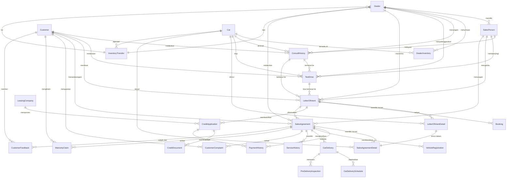

# Dokumentasi Awal: Business Process Modeling AutoCar Dealership (Refactored)

## 1. Pendahuluan

Dokumentasi ini memetakan proses bisnis penjualan mobil di AutoCar Dealership ke dalam entitas dan tabel database, sebagai dasar desain sistem informasi yang mendukung berbagai dealer AutoCar.

## 2. Pemetaan Proses Bisnis ke Entitas/Tabel

| Proses Bisnis                | Entitas/Tabel Utama         | Makna/Deskripsi Singkat                                                                 |
|------------------------------|-----------------------------|----------------------------------------------------------------------------------------|
| Konsultasi Awal              | ConsultHistory, Dealer, Customer, SalesPerson, Car | Data konsultasi awal, dealer, pelanggan, petugas penjualan, dan mobil yang diminati |
| Test Drive                   | TestDrive                   | Catatan test drive                                                                      |
| Kesepakatan & Booking Fee    | Booking, LetterOfIntent, LetterOfIntentDetail | Pencatatan booking fee, dokumen LOI (header), dan detail unit mobil di LOI             |
| Proses Kredit                | CreditApplication, LeasingCompany, CreditDocument | Pengajuan kredit, data leasing, dan dokumen pendukung                          |
| Pembayaran & Administrasi    | PaymentHistory, VehicleRegistration, SalesAgreement, SalesAgreementDetail | Pembayaran DP/lunas, administrasi, transaksi penjualan, dan detail mobil yang dibeli   |
| Serah Terima Mobil           | CarDelivery, PreDeliveryInspection, SalesAgreement, SalesAgreementDetail, CarDeliverySchedule | Proses PDI, serah terima mobil, penjadwalan pengiriman, transaksi, dan detail mobil    |
| Pasca-Penjualan              | ServiceHistory, CustomerComplaint, WarrantyClaim, CustomerFeedback, SalesAgreement | Layanan follow-up servis pertama, penanganan keluhan, klaim garansi, feedback pelanggan, dan transaksi |
| Manajemen Stok & Mutasi      | DealerInventory, InventoryTransfer, Dealer, Car | Pengelolaan stok mobil dan mutasi antar dealer                                          |

## 3. Makna Setiap Entitas/Tabel

| No. | Tabel                  | Makna/Deskripsi                                                                 |
|-----|------------------------|---------------------------------------------------------------------------------|
| 1   | LetterOfIntent         | Header dokumen LOI, berisi info umum pemesanan dan pelanggan.                   |
| 2   | LetterOfIntentDetail   | Rincian unit mobil yang dipesan dalam satu LOI.                                 |
| 3   | SalesAgreement         | Catatan transaksi penjualan yang dibuat setelah pembayaran dan administrasi selesai. |
| 4   | SalesAgreementDetail   | Rincian unit mobil yang dibeli dalam satu transaksi.                              |
| 5   | ConsultHistory         | Catatan konsultasi awal: kebutuhan, preferensi, tanggal, dan hasil diskusi.     |
| 6   | Dealer                 | Data dealer AutoCar, lokasi, dan identitas dealer.                              |
| 7   | Customer               | Menyimpan data pelanggan yang melakukan pembelian mobil.                        |
| 8   | SalesPerson            | Data petugas penjualan yang menangani pelanggan.                                |
| 9   | Car                    | Data mobil yang tersedia untuk dijual di setiap dealer.                         |
| 10  | TestDrive              | Catatan aktivitas test drive oleh pelanggan.                                    |
| 11  | Booking                | Data pembayaran booking fee dan status booking.                                 |
| 12  | CreditApplication      | Data pengajuan kredit oleh pelanggan.                                           |
| 13  | LeasingCompany         | Data perusahaan leasing yang bekerja sama.                                      |
| 14  | CreditDocument         | Dokumen pendukung pengajuan kredit (KTP, slip gaji, dll).                       |
| 15  | PaymentHistory         | Catatan pembayaran DP, pelunasan, atau cicilan kredit.                          |
| 16  | VehicleRegistration    | Proses administrasi STNK, BPKB, pajak, asuransi.                                |
| 17  | CarDelivery            | Proses serah terima mobil ke pelanggan.                                         |
| 18  | CarDeliverySchedule    | Penjadwalan pengiriman kendaraan ke pelanggan.                                  |
| 19  | PreDeliveryInspection  | Catatan Pre-Delivery Inspection (PDI) oleh teknisi.                             |
| 20  | ServiceHistory         | Layanan purna jual, seperti follow-up servis pertama.                           |
| 21  | CustomerComplaint      | Catatan keluhan pelanggan terkait produk atau layanan.                          |
| 22  | WarrantyClaim          | Klaim garansi kendaraan oleh pelanggan.                                         |
| 23  | DealerInventory        | Data stok mobil di setiap dealer.                                               |
| 24  | InventoryTransfer      | Catatan mutasi (perpindahan) stok antar dealer.                                 |
| 25  | CustomerFeedback       | Feedback atau survey kepuasan pelanggan setelah transaksi.                      |

## 4. Relasi Antar Entitas/Tabel

| Relasi                        | Tabel Sumber         | Tabel Tujuan         | Kardinalitas & Makna                                                                 |
|-------------------------------|----------------------|----------------------|--------------------------------------------------------------------------------------|
| Dealer memiliki banyak        | SalesPerson          | Dealer               | Satu dealer punya banyak sales person                                                |
| Dealer memiliki banyak        | DealerInventory      | Dealer               | Satu dealer punya banyak stok mobil                                                  |
| Dealer memiliki banyak        | ConsultHistory       | Dealer               | Satu dealer menangani banyak konsultasi                                              |
| Customer melakukan banyak     | ConsultHistory       | Customer             | Satu customer bisa melakukan banyak konsultasi                                       |
| Customer melakukan banyak     | LetterOfIntent       | Customer             | Satu customer bisa membuat banyak LOI                                                |
| LetterOfIntent memiliki banyak| LetterOfIntentDetail | LetterOfIntent       | Satu LOI bisa berisi banyak mobil                                                    |
| SalesAgreement memiliki banyak| SalesAgreementDetail | SalesAgreement       | Satu transaksi bisa berisi banyak mobil                                              |
| LetterOfIntent terkait        | Booking              | LetterOfIntent       | Satu LOI bisa punya satu/many booking                                                |
| CreditApplication terkait     | LeasingCompany       | CreditApplication    | Satu pengajuan kredit bisa terkait dengan satu perusahaan leasing                    |
| LetterOfIntent terkait        | CreditApplication    | LetterOfIntent       | Satu LOI bisa punya satu/many pengajuan kredit                                       |
| SalesAgreement terkait        | PaymentHistory       | SalesAgreement       | Satu transaksi bisa punya banyak pembayaran                                          |
| CreditApplication terkait     | PaymentHistory       | CreditApplication    | Satu pengajuan kredit bisa punya banyak pembayaran cicilan                           |
| SalesAgreement terkait        | CarDelivery          | SalesAgreement       | Satu transaksi bisa punya satu/many pengiriman                                       |
| CarDelivery terkait           | CarDeliverySchedule  | CarDelivery          | Satu pengiriman bisa punya satu jadwal                                               |
| Customer terkait              | CustomerComplaint    | Customer             | Satu customer bisa punya banyak keluhan                                              |
| Customer terkait              | WarrantyClaim        | Customer             | Satu customer bisa punya banyak klaim garansi                                        |
| Customer terkait              | CustomerFeedback     | Customer             | Satu customer bisa punya banyak feedback                                             |
| Car terkait                   | DealerInventory      | Car                  | Satu mobil bisa ada di banyak stok dealer                                            |
| InventoryTransfer terkait     | Dealer, DealerInventory| InventoryTransfer    | Mutasi stok antar dealer dan inventory                                               |
| SalesAgreementDetail terkait  | LetterOfIntentDetail | SalesAgreementDetail | Satu detail transaksi bisa terkait dengan satu detail LOI                            |

## 5. Diagram Relasi (ERD) - Ringkas


```mermaid
erDiagram
    Dealer ||--o{ SalesPerson : "memiliki"
    Dealer ||--o{ DealerInventory : "menyimpan"
    Dealer ||--o{ ConsultHistory : "menangani"
    Dealer ||--o{ TestDrive : "menyelenggarakan"
    Dealer ||--o{ LetterOfIntent : "menerima"
    Dealer ||--o{ SalesAgreement : "melakukan"
    Dealer }o--|| InventoryTransfer : "dari"
    Dealer }o--|| InventoryTransfer : "ke"

    Customer ||--o{ ConsultHistory : "melakukan"
    Customer ||--o{ TestDrive : "melakukan"
    Customer ||--o{ LetterOfIntent : "membuat"
    Customer ||--o{ SalesAgreement : "menandatangani"
    Customer ||--o{ CustomerComplaint : "mengajukan"
    Customer ||--o{ WarrantyClaim : "mengklaim"
    Customer ||--o{ CustomerFeedback : "memberi"

    SalesPerson ||--o{ ConsultHistory : "melayani"
    SalesPerson ||--o{ TestDrive : "mendampingi"
    SalesPerson ||--o{ LetterOfIntent : "mengelola"
    SalesPerson ||--o{ SalesAgreement : "menangani"

    Car ||--o{ DealerInventory : "tersedia di"
    Car ||--o{ ConsultHistory : "diminati"
    Car ||--o{ TestDrive : "diuji"
    Car ||--o{ LetterOfIntentDetail : "dirinci"
    Car ||--o{ SalesAgreementDetail : "terjual"
    Car ||--o{ InventoryTransfer : "dipindah"

    ConsultHistory ||--o{ TestDrive : "berlanjut ke"
    ConsultHistory ||--o{ LetterOfIntent : "berlanjut ke"

    TestDrive ||--o{ LetterOfIntent : "bisa berlanjut ke"

    LetterOfIntent ||--o{ LetterOfIntentDetail : "memiliki rincian"
    LetterOfIntent ||--o{ Booking : "terkait"
    LetterOfIntent ||--o{ CreditApplication : "membutuhkan"
    LetterOfIntent ||--o{ SalesAgreement : "diformalkan"

    LeasingCompany ||--o{ CreditApplication : "memproses"

    CreditApplication ||--o{ CreditDocument : "membutuhkan"
    CreditApplication ||--o{ PaymentHistory : "terkait"

    SalesAgreement ||--o{ SalesAgreementDetail : "memiliki rincian"
    SalesAgreement ||--o{ PaymentHistory : "memiliki"
    SalesAgreement ||--o{ VehicleRegistration : "membutuhkan"
    SalesAgreement ||--o{ CarDelivery : "menghasilkan"
    SalesAgreement ||--o{ ServiceHistory : "memiliki"
    SalesAgreement ||--o{ CustomerComplaint : "terkait"
    SalesAgreement ||--o{ WarrantyClaim : "terkait"
    SalesAgreement ||--o{ CustomerFeedback : "subjek dari"

    LetterOfIntentDetail ||--|| SalesAgreementDetail : "dirinci dalam"

    CarDelivery ||--o{ CarDeliverySchedule : "dijadwalkan"
    CarDelivery ||--o{ PreDeliveryInspection : "menjalani"
```

## 6. Desain Kolom Tabel Utama

### 1. Tabel: LetterOfIntent (Header)
| Nama Kolom       | Tipe Data      | Keterangan                               |
|------------------|----------------|------------------------------------------|
| LOIID            | INT, PK        | ID unik untuk setiap LOI                 |
| DealerID         | INT, FK        | ID dealer tempat LOI dibuat              |
| CustomerID       | INT, FK        | ID pelanggan yang membuat LOI            |
| SalesPersonID    | INT, FK        | ID sales person yang menangani           |
| ConsultHistoryID | INT, FK        | ID konsultasi terkait (opsional)         |
| TestDriveID      | INT, FK        | ID test drive terkait (opsional)         |
| LOIDate          | DATE           | Tanggal LOI dibuat                       |
| PaymentMethod    | VARCHAR(20)    | Metode pembayaran yang disepakati       |
| Note             | VARCHAR(200)   | Catatan umum untuk LOI                   |

### 2. Tabel: LetterOfIntentDetail
| Nama Kolom      | Tipe Data      | Keterangan                               |
|-----------------|----------------|------------------------------------------|
| LOIDetailID     | INT, PK        | ID unik untuk setiap detail LOI          |
| LOIID           | INT, FK        | ID LOI header                            |
| CarID           | INT, FK        | ID mobil yang dipesan                    |
| AgreedPrice     | MONEY          | Harga final mobil                        |
| Discount        | MONEY          | Diskon yang diberikan (opsional)         |
| DownPayment     | MONEY          | Uang muka yang dibayar (opsional)        |
| Note            | VARCHAR(200)   | Catatan spesifik untuk unit mobil ini    |

### 3. Tabel: SalesAgreement (Header)
| Nama Kolom        | Tipe Data      | Keterangan                               |
|-------------------|----------------|------------------------------------------|
| SalesAgreementID  | INT, PK        | ID unik untuk setiap transaksi           |
| DealerID          | INT, FK        | ID dealer tempat transaksi terjadi       |
| CustomerID        | INT, FK        | ID pelanggan yang bertransaksi           |
| SalesPersonID     | INT, FK        | ID sales person yang menangani           |
| LOIID             | INT, FK        | ID LOI terkait (opsional)                |
| TransactionDate   | DATE           | Tanggal transaksi                        |
| TotalAmount       | MONEY          | Total nilai transaksi                    |

### 4. Tabel: SalesAgreementDetail
| Nama Kolom             | Tipe Data      | Keterangan                               |
|------------------------|----------------|------------------------------------------|
| SalesAgreementDetailID | INT, PK        | ID unik untuk setiap detail transaksi    |
| SalesAgreementID       | INT, FK        | ID transaksi header                      |
| LOIDetailID            | INT, FK        | ID detail LOI terkait (opsional)         |
| CarID                  | INT, FK        | ID mobil yang dibeli                     |
| Price                  | MONEY          | Harga mobil saat transaksi               |
| Discount               | MONEY          | Diskon yang diberikan (opsional)         |
| Note                   | VARCHAR(200)   | Catatan spesifik untuk unit mobil ini    |

### 5. Tabel: ConsultHistory
| Nama Kolom         | Tipe Data      | Keterangan                               |
|--------------------|----------------|------------------------------------------|
| ConsultHistoryID   | INT, PK        | ID unik untuk setiap konsultasi          |
| DealerID           | INT, FK        | ID dealer tempat konsultasi              |
| CustomerID         | INT, FK        | ID pelanggan yang berkonsultasi          |
| SalesPersonID      | INT, FK        | ID sales person yang melayani            |
| CarID              | INT, FK        | ID mobil yang diminati (opsional)        |
| Budget             | MONEY          | Anggaran pelanggan (opsional)            |
| PaymentMethod      | VARCHAR(20)    | Metode pembayaran yang direncanakan     |
| ConsultationDate   | DATETIME       | Tanggal konsultasi                       |
| Note               | VARCHAR(200)   | Catatan dari konsultasi                  |

### 6. Tabel: Dealer
| Nama Kolom    | Tipe Data      | Keterangan                               |
|---------------|----------------|------------------------------------------|
| DealerID      | INT, PK        | ID unik untuk setiap dealer              |
| Name          | VARCHAR(100)   | Nama dealer                              |
| City          | VARCHAR(50)    | Kota lokasi dealer                       |
| Address       | VARCHAR(200)   | Alamat lengkap dealer                    |
| PhoneNumber   | VARCHAR(20)    | Nomor telepon dealer                     |

### 7. Tabel: Customer
| Nama Kolom    | Tipe Data      | Keterangan                               |
|---------------|----------------|------------------------------------------|
| CustomerID    | INT, PK        | ID unik untuk setiap pelanggan           |
| Name          | VARCHAR(100)   | Nama lengkap pelanggan                   |
| PhoneNumber   | VARCHAR(20)    | Nomor telepon pelanggan                  |
| Email         | VARCHAR(100)   | Alamat email pelanggan                   |
| Address       | VARCHAR(200)   | Alamat lengkap pelanggan                 |

### 8. Tabel: SalesPerson
| Nama Kolom      | Tipe Data      | Keterangan                               |
|-----------------|----------------|------------------------------------------|
| SalesPersonID   | INT, PK        | ID unik untuk setiap sales person        |
| DealerID        | INT, FK        | ID dealer tempat sales person bekerja    |
| Name            | VARCHAR(100)   | Nama lengkap sales person                |

### 9. Tabel: Car
| Nama Kolom  | Tipe Data      | Keterangan                               |
|-------------|----------------|------------------------------------------|
| CarID       | INT, PK        | ID unik untuk setiap mobil               |
| Model       | VARCHAR(100)   | Nama/model mobil (e.g., Mitsu Pajero)    |
| CarType     | VARCHAR(50)    | Tipe mobil (e.g., SUV, MPV)              |
| BasePrice   | MONEY          | Harga dasar mobil                        |
| Year        | INT            | Tahun pembuatan mobil                    |
| Color       | VARCHAR(30)    | Warna mobil                              |

### 10. Tabel: TestDrive
| Nama Kolom         | Tipe Data      | Keterangan                               |
|--------------------|----------------|------------------------------------------|
| TestDriveID        | INT, PK        | ID unik untuk setiap test drive          |
| DealerID           | INT, FK        | ID dealer tempat test drive              |
| CustomerID         | INT, FK        | ID pelanggan yang melakukan test drive   |
| SalesPersonID      | INT, FK        | ID sales person yang mendampingi         |
| CarID              | INT, FK        | ID mobil yang di-test drive              |
| ConsultHistoryID   | INT, FK        | ID konsultasi terkait (opsional)         |
| TestDriveDate      | DATETIME       | Tanggal test drive                       |
| Note               | VARCHAR(200)   | Catatan dari test drive                  |

### 11. Tabel: Booking
| Nama Kolom    | Tipe Data      | Keterangan                               |
|---------------|----------------|------------------------------------------|
| BookingID     | INT, PK        | ID unik untuk setiap booking             |
| LOIID         | INT, FK        | ID LOI terkait                           |
| BookingFee    | MONEY          | Jumlah booking fee                       |
| BookingDate   | DATE           | Tanggal booking                          |
| Status        | VARCHAR(20)    | Status booking (e.g., Confirmed, Cancelled) |

### 12. Tabel: CreditApplication
| Nama Kolom         | Tipe Data      | Keterangan                               |
|--------------------|----------------|------------------------------------------|
| CreditAppID        | INT, PK        | ID unik untuk setiap pengajuan kredit    |
| LOIID              | INT, FK        | ID LOI terkait                           |
| LeasingCompanyID   | INT, FK        | ID perusahaan leasing                    |
| ApplicationDate    | DATE           | Tanggal pengajuan                        |
| Status             | VARCHAR(20)    | Status pengajuan (e.g., Approved, Rejected) |

### 13. Tabel: LeasingCompany
| Nama Kolom       | Tipe Data      | Keterangan                               |
|------------------|----------------|------------------------------------------|
| LeasingCompanyID | INT, PK        | ID unik untuk setiap perusahaan leasing  |
| Name             | VARCHAR(100)   | Nama perusahaan leasing                  |
| Address          | VARCHAR(200)   | Alamat perusahaan leasing                |
| PhoneNumber      | VARCHAR(20)    | Nomor telepon perusahaan leasing         |

### 14. Tabel: CreditDocument
| Nama Kolom         | Tipe Data      | Keterangan                               |
|--------------------|----------------|------------------------------------------|
| CreditDocumentID   | INT, PK        | ID unik untuk setiap dokumen             |
| CreditAppID        | INT, FK        | ID pengajuan kredit terkait              |
| DocumentType       | VARCHAR(50)    | Jenis dokumen (e.g., KTP, Slip Gaji)     |
| DocumentPath       | VARCHAR(200)   | Path file dokumen                        |
| UploadDate         | DATE           | Tanggal upload dokumen                   |

### 15. Tabel: PaymentHistory
| Nama Kolom         | Tipe Data      | Keterangan                               |
|--------------------|----------------|------------------------------------------|
| PaymentHistoryID   | INT, PK        | ID unik untuk setiap pembayaran          |
| SalesAgreementID   | INT, FK        | ID transaksi terkait (opsional)          |
| CreditAppID        | INT, FK        | ID pengajuan kredit terkait (opsional)   |
| PaymentAmount      | MONEY          | Jumlah pembayaran                        |
| PaymentDate        | DATE           | Tanggal pembayaran                       |
| PaymentType        | VARCHAR(20)    | Jenis pembayaran (e.g., DP, Lunas, Cicilan) |

### 16. Tabel: VehicleRegistration
| Nama Kolom              | Tipe Data      | Keterangan                               |
|-------------------------|----------------|------------------------------------------|
| VehicleRegistrationID   | INT, PK        | ID unik untuk setiap administrasi        |
| SalesAgreementID        | INT, FK        | ID transaksi terkait                     |
| RegistrationNumber      | VARCHAR(50)    | Nomor STNK                               |
| OwnershipBookNumber     | VARCHAR(50)    | Nomor BPKB                               |
| TaxStatus               | VARCHAR(50)    | Status pajak                             |
| InsuranceStatus         | VARCHAR(50)    | Status asuransi                          |

### 17. Tabel: CarDelivery
| Nama Kolom       | Tipe Data      | Keterangan                               |
|------------------|----------------|------------------------------------------|
| CarDeliveryID    | INT, PK        | ID unik untuk setiap pengiriman          |
| SalesAgreementID | INT, FK        | ID transaksi terkait                     |
| DeliveryDate     | DATETIME       | Tanggal pengiriman                       |
| Status           | VARCHAR(20)    | Status pengiriman (e.g., Delivered, In Progress) |

### 18. Tabel: CarDeliverySchedule
| Nama Kolom              | Tipe Data      | Keterangan                               |
|-------------------------|----------------|------------------------------------------|
| CarDeliveryScheduleID   | INT, PK        | ID unik untuk setiap jadwal pengiriman   |
| CarDeliveryID           | INT, FK        | ID pengiriman terkait                    |
| ScheduledDate           | DATE           | Tanggal yang dijadwalkan                 |
| Note                    | VARCHAR(200)   | Catatan untuk jadwal pengiriman          |

### 19. Tabel: PreDeliveryInspection
| Nama Kolom              | Tipe Data      | Keterangan                               |
|-------------------------|----------------|------------------------------------------|
| PreDeliveryInspectionID | INT, PK        | ID unik untuk setiap inspeksi            |
| CarDeliveryID           | INT, FK        | ID pengiriman terkait                    |
| InspectionDate          | DATE           | Tanggal inspeksi                         |
| InspectorName           | VARCHAR(100)   | Nama inspektur                           |
| Note                    | VARCHAR(200)   | Catatan dari inspeksi                    |

### 20. Tabel: ServiceHistory
| Nama Kolom       | Tipe Data      | Keterangan                               |
|------------------|----------------|------------------------------------------|
| ServiceID        | INT, PK        | ID unik untuk setiap layanan purna jual  |
| SalesAgreementID | INT, FK        | ID transaksi terkait                     |
| ServiceDate      | DATE           | Tanggal layanan                          |
| ServiceType      | VARCHAR(50)    | Jenis layanan (e.g., Servis Pertama)     |
| Note             | VARCHAR(200)   | Catatan dari layanan                     |

### 21. Tabel: CustomerComplaint
| Nama Kolom          | Tipe Data      | Keterangan                               |
|---------------------|----------------|------------------------------------------|
| CustomerComplaintID | INT, PK        | ID unik untuk setiap keluhan             |
| CustomerID          | INT, FK        | ID pelanggan yang mengajukan keluhan     |
| SalesAgreementID    | INT, FK        | ID transaksi terkait (opsional)          |
| ComplaintDate       | DATETIME       | Tanggal keluhan                          |
| Description         | VARCHAR(200)   | Deskripsi keluhan                        |
| Status              | VARCHAR(20)    | Status penanganan keluhan                |

### 22. Tabel: WarrantyClaim
| Nama Kolom         | Tipe Data      | Keterangan                               |
|--------------------|----------------|------------------------------------------|
| WarrantyClaimID    | INT, PK        | ID unik untuk setiap klaim garansi       |
| CustomerID         | INT, FK        | ID pelanggan yang mengajukan klaim       |
| SalesAgreementID   | INT, FK        | ID transaksi terkait (opsional)          |
| ClaimDate          | DATETIME       | Tanggal klaim                            |
| Description        | VARCHAR(200)   | Deskripsi klaim                          |
| Status             | VARCHAR(20)    | Status penanganan klaim                  |

### 23. Tabel: DealerInventory
| Nama Kolom          | Tipe Data      | Keterangan                               |
|---------------------|----------------|------------------------------------------|
| DealerInventoryID   | INT, PK        | ID unik untuk setiap entri inventaris    |
| DealerID            | INT, FK        | ID dealer pemilik stok                   |
| CarID               | INT, FK        | ID mobil dalam stok                      |
| Stock               | INT            | Jumlah stok mobil                        |
| Price               | MONEY          | Harga jual mobil di dealer ini           |
| DiscountPercent     | DECIMAL(5,2)   | Persentase diskon default dealer-mobil   |
| FeePercent          | DECIMAL(5,2)   | Persentase fee dealer-mobil              |

### 24. Tabel: InventoryTransfer
| Nama Kolom          | Tipe Data      | Keterangan                               |
|---------------------|----------------|------------------------------------------|
| InventoryTransferID | INT, PK        | ID unik untuk setiap mutasi stok         |
| FromDealerID        | INT, FK        | ID dealer asal                           |
| ToDealerID          | INT, FK        | ID dealer tujuan                         |
| CarID               | INT, FK        | ID mobil yang dimutasi                   |
| Quantity            | INT            | Jumlah mobil yang dimutasi               |
| MutationDate        | DATE           | Tanggal mutasi                           |

### 25. Tabel: CustomerFeedback
| Nama Kolom         | Tipe Data      | Keterangan                               |
|--------------------|----------------|------------------------------------------|
| CustomerFeedbackID | INT, PK        | ID unik untuk setiap feedback            |
| CustomerID         | INT, FK        | ID pelanggan yang memberikan feedback    |
| SalesAgreementID   | INT, FK        | ID transaksi terkait (opsional)          |
| FeedbackDate       | DATE           | Tanggal feedback                         |
| Rating             | INT            | Peringkat kepuasan (1-5)                 |
| Comment            | VARCHAR(200)   | Komentar dari pelanggan                  |

## 7. Stored Procedures

### 1. Pendaftaran Pelanggan Baru
Stored procedure ini akan digunakan untuk mendaftarkan pelanggan baru ke dalam sistem.

**Nama:** `sp_RegisterCustomer`

**Parameter:**
- `@Name VARCHAR(100)`
- `@PhoneNumber VARCHAR(20)`
- `@Email VARCHAR(100)`
- `@Address VARCHAR(200)`

**Proses:**
1.  Menambahkan data pelanggan baru ke tabel `Customer`.
2.  Mengembalikan `CustomerID` dari pelanggan yang baru saja ditambahkan.

```sql
CREATE PROCEDURE sp_RegisterCustomer
    @Name VARCHAR(100),
    @PhoneNumber VARCHAR(20),
    @Email VARCHAR(100),
    @Address VARCHAR(200)
AS
BEGIN
    INSERT INTO Customer (Name, PhoneNumber, Email, Address)
    VALUES (@Name, @PhoneNumber, @Email, @Address);

    SELECT SCOPE_IDENTITY() AS CustomerID;
END
```

### 2. Pengajuan Kredit
Stored procedure ini akan digunakan untuk mengajukan kredit baru.

**Nama:** `sp_ApplyForCredit`

**Parameter:**
- `@LOIID INT`
- `@LeasingCompanyID INT`

**Proses:**
1.  Menambahkan data pengajuan kredit baru ke tabel `CreditApplication`.
2.  Mengembalikan `CreditAppID` dari pengajuan yang baru saja ditambahkan.

```sql
CREATE PROCEDURE sp_ApplyForCredit
    @LOIID INT,
    @LeasingCompanyID INT
AS
BEGIN
    INSERT INTO CreditApplication (LOIID, LeasingCompanyID, ApplicationDate, Status)
    VALUES (@LOIID, @LeasingCompanyID, GETDATE(), 'Pending');

    SELECT SCOPE_IDENTITY() AS CreditAppID;
END
```

### 3. Serah Terima Mobil
Stored procedure ini akan digunakan untuk mencatat serah terima mobil.

**Nama:** `sp_CreateCarDelivery`

**Parameter:**
- `@SalesAgreementID INT`

**Proses:**
1.  Menambahkan data serah terima baru ke tabel `CarDelivery`.
2.  Mengupdate status transaksi menjadi 'Completed'.

```sql
CREATE PROCEDURE sp_CreateCarDelivery
    @SalesAgreementID INT
AS
BEGIN
    INSERT INTO CarDelivery (SalesAgreementID, DeliveryDate, Status)
    VALUES (@SalesAgreementID, GETDATE(), 'Delivered');

    UPDATE SalesAgreement SET Status = 'Completed' WHERE SalesAgreementID = @SalesAgreementID;
END
```

## 8. Functions

### 1. Modularisasi Perhitungan Harga, Diskon, dan Fee

Fungsi-fungsi modular berikut digunakan untuk mengambil dan menghitung diskon, fee, dan harga akhir berdasarkan data master di DealerInventory:

#### a. `fn_GetDiscountAmount`
- Mengambil persentase diskon dari DealerInventory, lalu menghitung nilai diskon dari harga dasar.

#### b. `fn_GetFeeAmount`
- Mengambil persentase fee dari DealerInventory, lalu menghitung nilai fee dari harga dasar.

#### c. `fn_GetFinalPrice`
- Menghitung harga akhir mobil setelah diskon dan fee, dengan mengambil data Price, DiscountPercent, FeePercent dari DealerInventory.

Contoh implementasi:

```sql
-- Mendapatkan nilai diskon
SELECT dbo.fn_GetDiscountAmount(@DealerInventoryID);

-- Mendapatkan nilai fee
SELECT dbo.fn_GetFeeAmount(@DealerInventoryID);

-- Mendapatkan harga akhir
SELECT dbo.fn_GetFinalPrice(@DealerInventoryID);
```

## 9. Views

### 1. Laporan Penjualan
View ini akan digunakan untuk menampilkan laporan penjualan, termasuk harga, diskon, fee, dan harga akhir berdasarkan data DealerInventory.


**Nama:** `vw_Sales_Report`

**Proses:**
1.  Menggabungkan data dari tabel `SalesAgreement`, `SalesAgreementDetail`, `Customer`, `SalesPerson`, dan `Car`.
2.  Menampilkan informasi detail tentang setiap transaksi.

```sql
CREATE VIEW vw_Sales_Report AS
SELECT
    sa.SalesAgreementID,
    sa.TransactionDate,
    c.Name AS CustomerName,
    sp.Name AS SalesPersonName,
    cr.Model AS CarModel,
    di.Price,
    di.DiscountPercent,
    di.FeePercent,
    dbo.fn_GetDiscountAmount(di.DealerInventoryID) AS DiscountAmount,
    dbo.fn_GetFeeAmount(di.DealerInventoryID) AS FeeAmount,
    dbo.fn_GetFinalPrice(di.DealerInventoryID) AS FinalPrice
FROM
    SalesAgreement sa
    JOIN SalesAgreementDetail sad ON sa.SalesAgreementID = sad.SalesAgreementID
    JOIN DealerInventory di ON sad.CarID = di.CarID AND sa.DealerID = di.DealerID
    JOIN Customer c ON sa.CustomerID = c.CustomerID
    JOIN SalesPerson sp ON sa.SalesPersonID = sp.SalesPersonID
    JOIN Car cr ON sad.CarID = cr.CarID;
```

### 2. Status Kredit
View ini akan digunakan untuk menampilkan status pengajuan kredit.

**Nama:** `vw_Credit_Status`

**Proses:**
1.  Menggabungkan data dari tabel `CreditApplication`, `Customer`, dan `LeasingCompany`.
2.  Menampilkan informasi tentang status setiap pengajuan kredit.

```sql
CREATE VIEW vw_Credit_Status AS
SELECT
    ca.CreditAppID,
    c.Name AS CustomerName,
    l.Name AS LeasingCompanyName,
    ca.ApplicationDate,
    ca.Status
FROM
    CreditApplication ca
    JOIN LetterOfIntent loi ON ca.LOIID = loi.LOIID
    JOIN Customer c ON loi.CustomerID = c.CustomerID
    JOIN LeasingCompany l ON ca.LeasingCompanyID = l.LeasingCompanyID;
```

### 3. Daftar Mobil Tersedia
View ini akan digunakan untuk menampilkan daftar mobil yang tersedia di setiap dealer, beserta harga, diskon, dan fee default dari DealerInventory.

**Nama:** `vw_Available_Cars`

**Proses:**
1.  Menggabungkan data dari tabel `DealerInventory`, `Car`, dan `Dealer`.
2.  Menampilkan informasi tentang mobil yang tersedia di setiap dealer.

```sql
CREATE VIEW vw_Available_Cars AS
SELECT
    d.Name AS DealerName,
    c.Model AS CarModel,
    c.CarType,
    c.BasePrice,
    i.Stock,
    i.Price,
    i.DiscountPercent,
    i.FeePercent
FROM
    DealerInventory i
    JOIN Car c ON i.CarID = c.CarID
    JOIN Dealer d ON i.DealerID = d.DealerID
WHERE
    i.Stock > 0;
```

## 10. Triggers

### 1. Update Stok Mobil
Trigger ini akan digunakan untuk mengupdate stok mobil secara otomatis setelah transaksi selesai.

**Nama:** `trg_UpdateStockAfterSale`

**Proses:**
1.  Trigger akan aktif setelah ada data baru yang ditambahkan ke tabel `SalesAgreementDetail`.
2.  Mengurangi jumlah stok mobil di tabel `DealerInventory` sesuai dengan mobil yang terjual.

```sql
CREATE TRIGGER trg_UpdateStockAfterSale
ON SalesAgreementDetail
AFTER INSERT
AS
BEGIN
    UPDATE DealerInventory
    SET Stock = Stock - 1
    FROM DealerInventory i
    JOIN inserted ins ON i.CarID = ins.CarID
    JOIN SalesAgreement sa ON ins.SalesAgreementID = sa.SalesAgreementID
    WHERE i.DealerID = sa.DealerID;
END